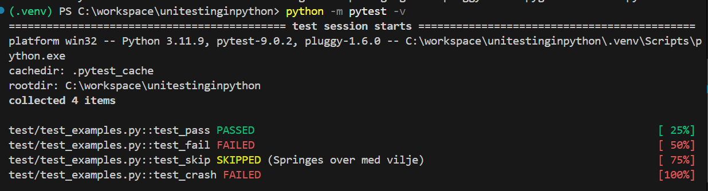
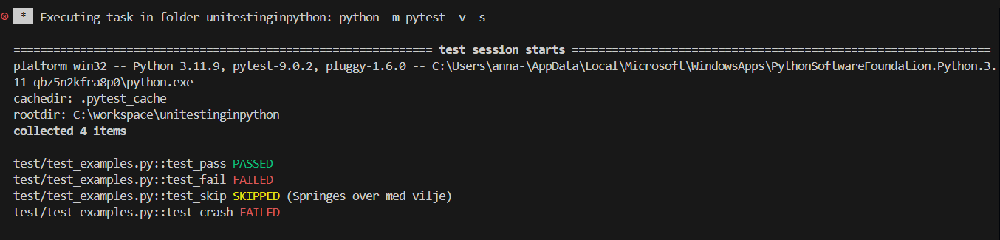

# it_sikkerhed_2026f
Dette er et projekt på **Zealand Næstved**. 

## Formål 
- IT-sikkerhed
- Git & GitHub
- VS Code

## Unit-testing i Python med pytest
Følgende skærmbilleder viser resultatet af kørsel med pytest, herunder beståelse, fejlede og skippede tests.

------------------------------------------------------------------
# Password-validering

Jeg vælger password som mit emne.  
Et login-system består af brugernavn + password, og for at sikre systemet mod svage passwords og misbrug, stilles der krav til længde, indhold og struktur.  
Password-validering er en vigtig del af IT-sikkerhed, fordi det er en af de mest almindelige angrebsflader i et system.

---

## Ækvivalensklasser

Regler:
- Password længde 8–20 tegn
- Indeholder mindst ét tal
- Indeholder mindst ét specialtegn

Ækvivalensklasser bruges til at opdele inputs i grupper, hvor systemet forventes at reagere ens.  
Det gør det lettere at teste mange forskellige typer inputs uden at teste alt.

| Eksempel        | Type              | Godkendt |
|-----------------|-------------------|----------|
| Sikkerhed123!   | Gyldig            | Godkendt |
| 1               | For kort          | Ikke godkendt |
| Over25TegnHer…  | For lang          | Ikke godkendt |
| Sikkerhed       | Intet tal         | Ikke godkendt |
| Sikkerhed123    | Intet specialtegn | Ikke godkendt |

Fordele:
- Giver hurtigt overblik over gyldige/ugyldige inputs  
- Reducerer antallet af nødvendige testcases  

Ulemper:
- Kan overse edge cases  
- Kræver korrekt opdeling af klasser  

Security gate: **Build & Test**

---

## Grænseværdier

Regler:
- Password længde 8–20 tegn

Grænseværdier bruges til at teste lige omkring de kritiske grænser, hvor fejl ofte opstår.

| Eksempel | Type                     | Godkendt |
|----------|---------------------------|----------|
| 7 tegn   | Lige under grænsen        | Ikke godkendt |
| 8 tegn   | Lige på grænsen           | Godkendt |
| 20 tegn  | Øvre grænse               | Godkendt |
| 21 tegn  | Lige over grænsen         | Ikke godkendt |

Fordele:
- Finder fejl tæt på kritiske grænser  
- God til input-validering  

Ulemper:
- Tester ikke hele inputområdet  
- Kræver præcis viden om grænserne  

Security gate: **Build & Test**

---

## CRUD(L)

CRUD bruges til at teste hele livscyklussen for password-håndtering i systemet.

| Operation | Testbeskrivelse                 | Forventet resultat |
|-----------|----------------------------------|---------------------|
| Create    | Opret bruger med stærkt password | Success             |
| Read      | Hent password-policy             | Returneres          |
| Update    | Skift password til for svagt     | Afvist              |
| Delete    | Slet bruger                      | Success             |
| List      | List password-krav               | Returneres          |

Fordele:
- Tester hele password-livscyklussen  
- Afslører fejl i backend-logik og datalagring  

Ulemper:
- Kræver database eller mock-miljø  
- Mere tidskrævende end unit tests  

Security gate: **Build & Test + Release**

---

## Cycle Process Test

Flow:
1. Opret bruger med gyldigt password  
2. Login  
3. Skift password  
4. Login igen  
5. Slet bruger  

Cycle tests bruges til at teste hele brugerrejsen og sikre, at systemet fungerer korrekt i praksis.

Formål:
- Sikre at password-krav overholdes i hele processen  
- Validere at systemet reagerer korrekt ved ændringer  

Fordele:
- Tester realistiske brugerflows  
- Fanger fejl i integrationen mellem funktioner  

Ulemper:
- Længere testtid  
- Sværere at isolere fejl  

Security gate: **Release + Operate**

---

## Testpyramiden

Testpyramiden bruges til at strukturere testarbejdet og sikre en god balance mellem hurtige og langsomme tests.

Unit-tests:
- Password-validering (længde, tal, specialtegn)

Integration-tests:
- Login-flow (API + database)

UI-tests:
- Fejlbeskeder i login-formular

Fordele:
- Hurtig eksekvering i bunden  
- God struktur og høj testdækning  
- UI-tests giver overblik over brugeroplevelsen  

Ulemper:
- UI-tests er langsomme  
- Fejl kan være svære at lokalisere  

Security gate: **Build & Test**

---

## Decision Table Test

Decision tables bruges til at få overblik over alle kombinationer af regler og deres resultater.

Krav:
- Brugernavn unikt  
- Password 8–20 tegn  
- Mindst ét tal  
- Mindst ét specialtegn  

| # | Unikt brugernavn | 8–20 tegn | Tal | Specialtegn | Resultat                |
|---|------------------|-----------|-----|-------------|-------------------------|
| 1 | Ja               | Ja        | Ja  | Ja          | Bruger oprettes         |
| 2 | Ja               | Nej       | Ja  | Ja          | Afvist (WeakPassword)   |
| 3 | Ja               | Ja        | Nej | Ja          | Afvist (WeakPassword)   |
| 4 | Ja               | Ja        | Ja  | Nej         | Afvist (WeakPassword)   |
| 5 | Nej              | Ja        | Ja  | Ja          | Afvist (AlreadyExists)  |

Fordele:
- Giver komplet overblik over alle kombinationer  
- Nem at læse og forstå  
- Sikrer at ingen regler overses  

Ulemper:
- Kan blive stor ved mange regler  
- Kræver præcis definition af alle betingelser  

Security gate: **Build & Test**

---

## Security Gates (forklaring)

Security gates er kontrolpunkter i udviklingsprocessen, hvor man stopper op og vurderer kvalitet og sikkerhed, før man går videre.

**Build & Test:**  
- Fokus på validering, unit-tests og inputkontrol  
- Her fanges fejl i password-reglerne tidligt  
- Billigt at rette fejl her  

**Release:**  
- Systemet testes samlet  
- CRUD og cycle tests er relevante  
- Sikrer at funktionalitet og sikkerhed er stabil før deployment  

**Operate:**  
- Systemet kører i drift  
- Fokus på login-flow, brugeradfærd og fejl  
- Overvågning af misbrug, brute-force og fejl  

---
